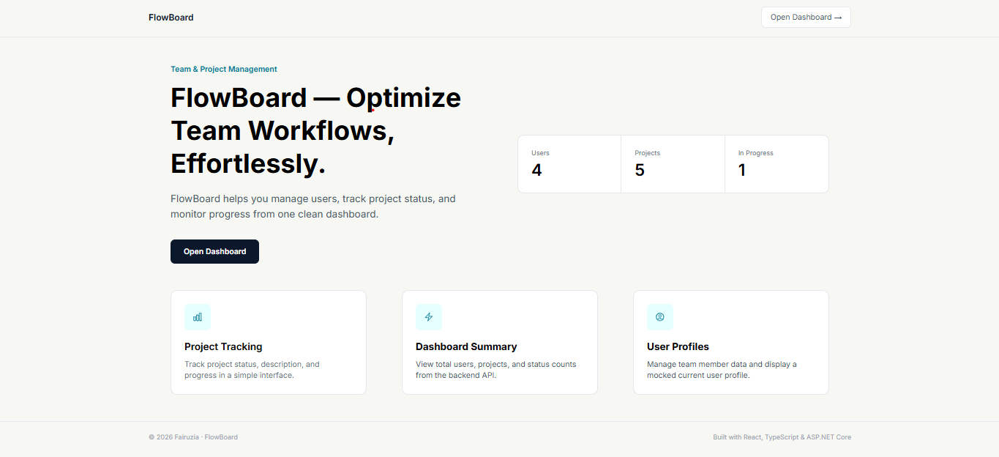
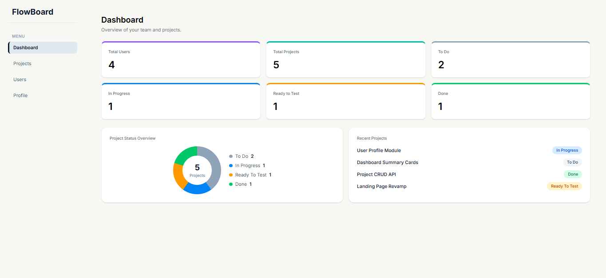
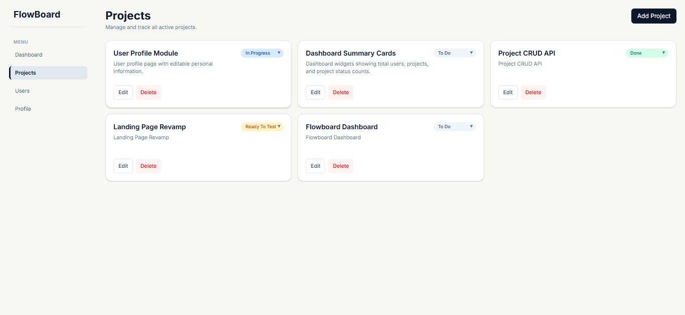
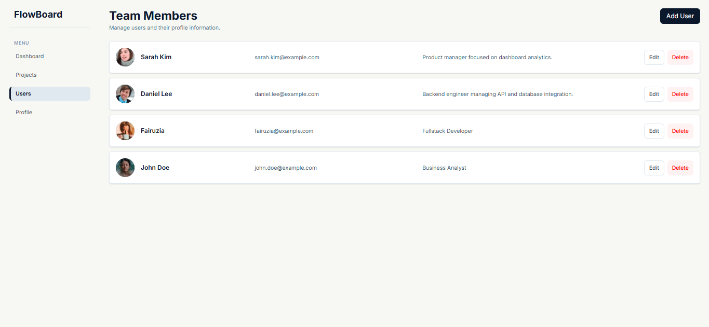
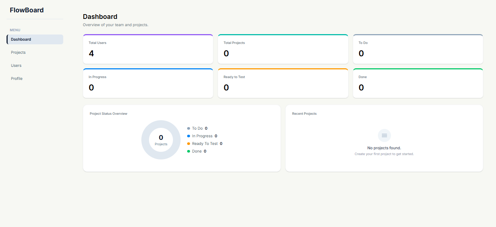

# FlowBoard

FlowBoard is a full-stack dashboard app I built for the VIBSL technical assessment. It covers user and project management with a simple REST API backend and React frontend.

## Tech Stack

### Backend
- ASP.NET Core Web API
- Entity Framework Core
- PostgreSQL
- Swagger

### Frontend
- React
- TypeScript
- Vite
- Tailwind CSS
- Axios
- React Router

---

## Backend Setup

1. Navigate to backend folder

```bash
cd backend/flowboard.api
```

2. Update PostgreSQL connection string in:

```txt
appsettings.json
```

3. Apply migrations

```bash
dotnet ef database update
```

4. Run backend

```bash
dotnet run
```

Default development URL:

https://localhost:7253
http://localhost:5271

Swagger:

```txt
https://localhost:7253/swagger
```

---

## Frontend Setup

1. Navigate to frontend folder

```bash
cd frontend
```

2. Install dependencies

```bash
npm install
```

3. Run development server

```bash
npm run dev
```

Frontend will run on:

```txt
http://localhost:5175
```

---

## Build

Frontend:

```bash
npm run build
```

Backend:

```bash
dotnet build
```

---

## Assumptions

- Profile page is mocked up. I set the first user loaded as logged in user because authentication is out of scope.
- Soft delete is used in case deleted data need to be recovered. 
- Project is not assigned to any user. New project default status is "To Do".
- Project status updated directly on each project card for quick edit. Status update on project card use local state update instead of reloading so the order stay the same.
- No status transition rules. User can change project to any status without following specific order.

## Limitations

- Authentication and authorization is not used in this project.
- No filter and pagination.
- Minimal error handling. API errors are logged but not shown to user.
- No loading state.

## Screenshots






## Demo Video
[Watch demo](https://drive.google.com/file/d/1jKWop3ETjHXzrkEAhXAfmmjpYCcj8li5/view?usp=sharing)